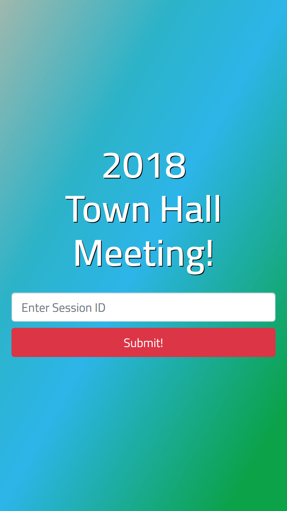
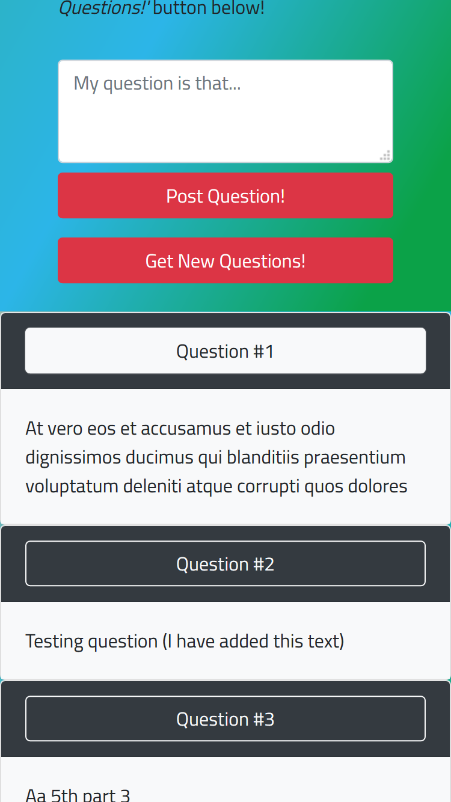
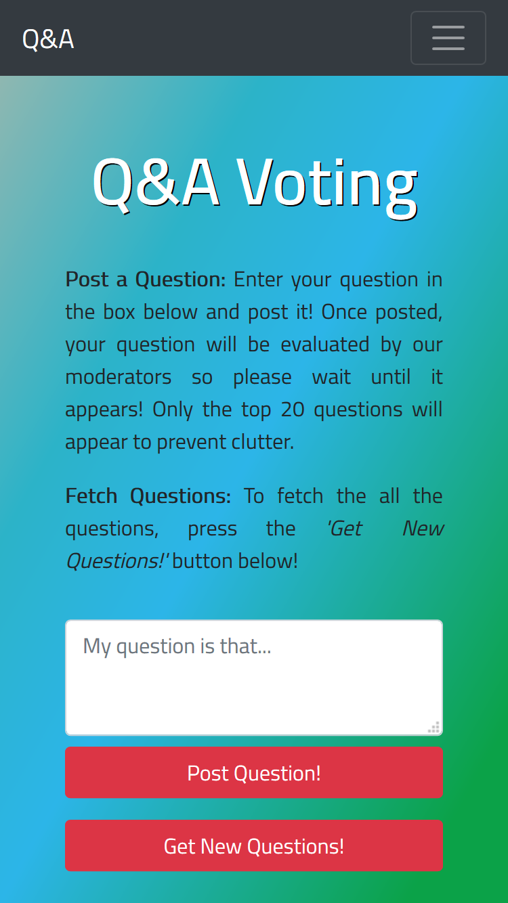
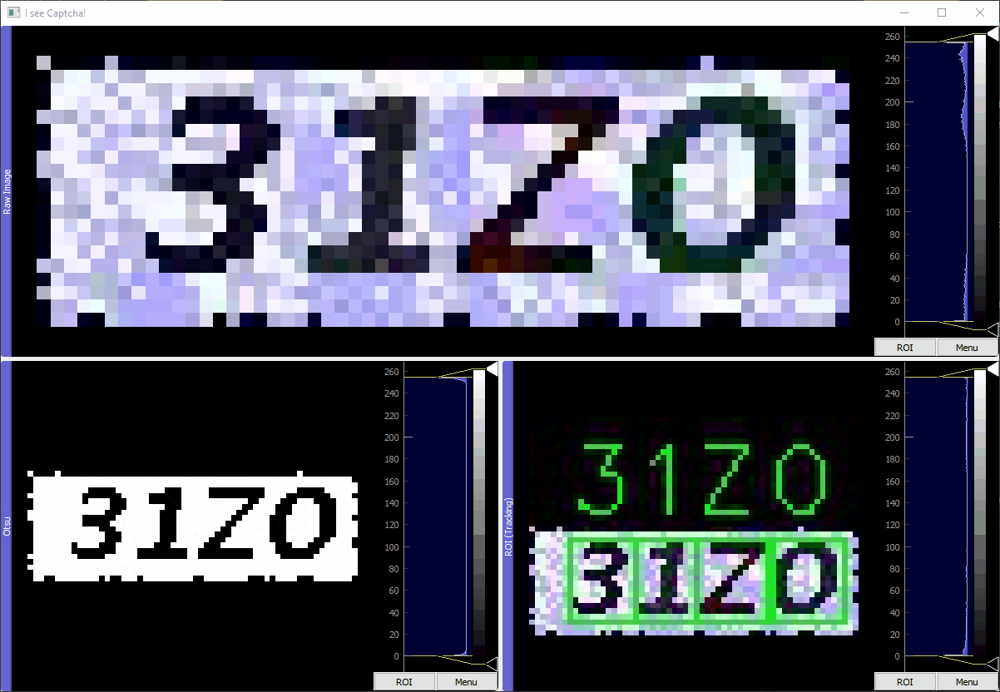

## Programming

### Project Vote: Q&A Webapp

  
  
  

* URL: <a href="https://github.com/othmanalikhan/project_vote">https://github.com/othmanalikhan/project_vote</a>
* Completion Date: from 2018 October to 2018 December

Project Vote is a web application written with Django that was used as the
realtime Q&A tool for a company wide event named "Town Hall". This event took
place on 16th December 2018 with an audience of 3,000 people. See the Key
Features section below for an overview.

### Key Features
- **Authentication:** Requires logging via session ID.
- **Realtime Q&A:** Allows posting and viewing of moderated questions.
- **Moderation:** Questions posted are sent to backend for moderation first.
- **Capacity:** ~2,000 clients.

---

### Project Captcha: Machine Learning Captcha Solver

* URL: <a href="https://github.com/othmanalikhan/project_captcha">https://github.com/othmanalikhan/project_captcha</a>
* Completion Date: from 2019 January to 2019 May

The objective of project captcha is three-fold: solving simple captchas that
are generated from a real system (albeit ancient), learning more about neural
networks for my own interest, and writing a guide for those who have just
started doing data science and/or neural networks.

Above is a summary animation of the results of this project: The top window is
the raw captcha, the bottom left window is the captcha with Otsu's algorithm
applied, and the bottom right window is the solved captcha with letter
tracking.

In short, the method used here to solve the captchas was to split the captcha
images into single letters, and then solve for each individual letter using a
convolution neural network (CNN). For those interested in the low level details
and a bit of a guide, see below (Part 0: Introduction).
